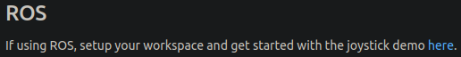

# Algorithm 1: Shifted Line Follow Using Proportional Yaw Rate
Clone this package into your catkin workspace. I call mine `actor_ws`.
```
git clone https://github.com/irisfield/shifted_line_pkg.git ~/actor_ws/src
```

# Dependencies
This package requires the `SteeringReport` message from the drive-by-wire (DBW) system located [here](https://bitbucket.org/DataspeedInc/dbw_polaris_ros/). The Installation steps are listed below.

## DBW Messages
Installation steps

### 1. SteeringReport Message
Navigate to Dataspeed's [dbw_polaris_ros](https://bitbucket.org/DataspeedInc/dbw_polaris_ros/) package.

You will see the following:


Click the `here` hyperlink and follow the all instructions up until it tells you to source the workspace.

### 2. UlcReport Message (Optional)
You should now have a `dbw_ws` in your home directory. This workspace contains the `SteeringReport` message but not the `UlcReport`, to install the `UlcReport` message, run the following commands:
```
cd ~/dbw_ws/src
git clone https://bitbucket.org/DataspeedInc/dataspeed_ulc_ros.git
```

### 3. Build
Source and then `catkin_make` the packages in the `~/dbw_ws` directory:
```
cd ~/dbw_ws
source devel/setup.sh
catkin_make
```

### 4. Test
The `steering_report` message should be built and ready to use. To test run a rosbag with the `/vehicle/steering_report` (or `/vehicle/ulc_report`) topics, then run the following command in a seperate terminal:
```
rostopic echo /vehicle/steering_report
```

This will only work if `setup.sh` file inside `~/dbw_ws/devel` is sourced OR if it was source before you built the `actor_ws` workspace.

### NOTE
Make sure you source `~/dbw_ws/devel/setup.sh` **before** building the the packages in `actor_ws` with the `catkin_make` command.

If this still gives you problem, delete the `~/actor_ws/build` directory and rebuild the workspace by running the following commands:
```
source ~/dbw_ws/devel/setup.sh
cd ~/actor_ws
rm -rf build
catkin_make
source devel/setup.sh
```

You only need to build `dbw_ws` once.
